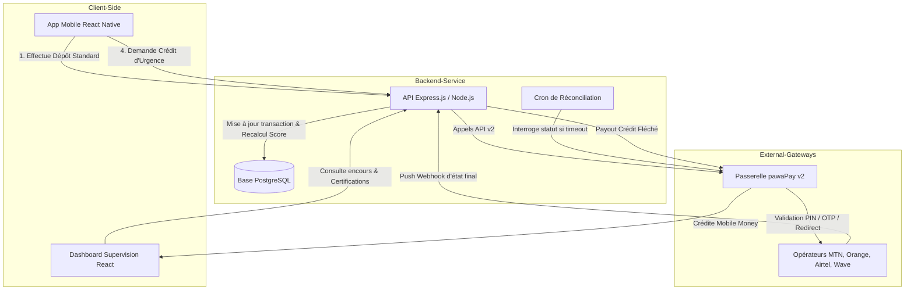

# Guide d'Implémentation Complet : Plateforme PawaSupply-Score 📊

Ce document sert de spécification technique de référence et de plan d'architecture pour l'implémentation de la plateforme **PawaSupply-Score**. Il intègre de manière robuste les spécifications de l'API **pawaPay v2 Merchant API** pour la gestion des dépôts, des décaissements (payouts), du webhook asynchrone, du moteur de scoring continu et du système de réconciliation.

---

## 1. Architecture Globale et Modèle Tripartite

La plateforme PawaSupply-Score connecte trois acteurs clés : le **Boutiquier** (l'acheteur), le **Grossiste** (le fournisseur de marchandises) et la **Banque** (le financeur).



---

## 2. Cartographie des Briques API pawaPay v2 Exploitées

Pour bâtir le backend Node.js/Express de manière chirurgicale, la plateforme PawaSupply-Score exploite 6 briques fonctionnelles clés de la Merchant API v2 de pawaPay.

### 1. La Phase de Prédication (Validation en amont)
- **Endpoint** : `POST /v2/predict-provider`
- **Utilité** : Appelé dès que le boutiquier saisit un numéro de téléphone sur l'application mobile React Native. Cet endpoint nettoie le numéro, valide sa syntaxe et détecte automatiquement s'il s'agit d'un numéro Orange Money, MTN MoMo, etc. Cela évite d'envoyer de fausses requêtes à pawaPay et fiabilise notre base PostgreSQL.

### 2. Le Pan "Dépôts" (Collecte de fonds propres)
- **Endpoint Principal** : `POST /v2/deposits`
- **Utilité** : Déclenché lorsque le boutiquier effectue ses achats courants en ligne avec ses propres fonds. Cet endpoint initie le prélèvement (USSD Push) sur son téléphone pour qu'il saisisse son code PIN. Chaque transaction réussie ici va nourrir le moteur de notation.
- **Endpoint de Secours** : `GET /v2/deposits/{depositId}`
- **Utilité** : Utilisé dans deux cas critiques :
  1. Pour notre script de réconciliation (Cron Job) qui vérifie les transactions restées bloquées en statut `PENDING`.
  2. Pour récupérer l'URL de redirection sécurisée (`authorizationUrl`) si le boutiquier utilise un portefeuille nécessitant une validation web (comme Wave au Sénégal ou en Côte d'Ivoire).

### 3. Le Pan "Décaissements" (Payouts / Crédits Fléchés)
- **Endpoint Principal** : `POST /v2/payouts`
- **Utilité** : C'est le cœur du crédit fléché. Dès que l'algorithme valide la demande d'urgence du boutiquier, cet endpoint ordonne le virement de masse instantané depuis le compte de la banque vers le compte Mobile Money (Marchand) du grossiste. Aucune action ou code PIN n'est requis de la part du grossiste.
- **Endpoint de Suivi** : `GET /v2/payouts/{payoutId}`
- **Utilité** : Utilisé par le Cron Job de réconciliation pour interroger pawaPay si le virement vers le grossiste a pris du retard (statut `ENQUEUED` ou `DELAYED` à cause d'une maintenance de l'opérateur GSM).

### 4. Le Pan "Écoute Asynchrone" (Webhooks v2)
- **Configuration** : Route du serveur backend `/pawapay/webhook`.
- **Utilité** : Indispensable, car pawaPay traite tout de manière asynchrone. Dès qu'un dépôt ou un payout change d'état (succès ou échec), pawaPay envoie instantanément un payload JSON à notre backend. C'est ce signal qui déclenche automatiquement le recalcul du score financier du boutiquier en tâche de fond.

### 5. Le Pan "Configuration Active" (Utilitaires)
- **Endpoint** : `GET /v2/active-conf`
- **Utilité** : Permet à notre backend d'interroger dynamiquement la configuration de pawaPay pour savoir quelles devises sont actives et, surtout, valider le paramètre `decimalsInAmount: NONE` pour les pays de la zone CEMAC (Cameroun, etc.) afin de s'assurer qu'on envoie bien des montants entiers arrondis sans décimales.

### 6. Le Pan "Réconciliation Globale" (Rapports de fin de journée)
- **Endpoint** : `POST /v2/statements` et `GET /v2/statements/{statementId}`
- **Utilité** : Permet de générer des rapports financiers complets sous forme de fichiers CSV de transactions de manière asynchrone. Utile pour fournir à l'interface "Banque" de notre tableau de bord la liste officielle des écritures comptables consolidées toutes les 24 heures.

---

## 3. Modèle de Données PostgreSQL

Pour supporter la nature asynchrone des transactions Mobile Money et assurer une traçabilité totale, le schéma SQL ci-dessous doit être déployé avec des contraintes strictes.

```sql
-- Enums pour les états de transaction pawaPay
CREATE TYPE pawapay_status AS ENUM (
  'PENDING',           -- Initié localement, en attente de soumission/callback
  'ACCEPTED',          -- Accepté par pawaPay pour traitement
  'PROCESSING',        -- En cours de traitement (ou redirection requise)
  'ENQUEUED',          -- Mis en file d'attente (opérateur en panne temporaire)
  'IN_RECONCILIATION', -- En cours de vérification de niveau 2 chez pawaPay
  'COMPLETED',         -- Succès final (fonds transférés)
  'FAILED'             -- Échec final (fonds non transférés)
);

CREATE TYPE transaction_type AS ENUM ('DEPOSIT', 'PAYOUT');

-- Enum pour les catégories de crédit des boutiquiers
CREATE TYPE boutiquier_category AS ENUM ('Observation', 'Standard', 'Or', 'Platine');

-- Enum pour le cycle de vie des crédits d'urgence
CREATE TYPE credit_status AS ENUM (
  'PENDING_DELIVERY',  -- Payout ACCEPTED par pawaPay, en attente de confirmation COMPLETED
  'ACTIVE',            -- Payout COMPLETED, crédit actif (en cours de remboursement)
  'REPAID',            -- Remboursement confirmé
  'DEFAULT',           -- Échéance dépassée sans remboursement
  'CANCELLED'          -- Payout FAILED, crédit annulé
);

-- Table des Boutiquiers
CREATE TABLE boutiquiers (
  id UUID PRIMARY KEY DEFAULT gen_random_uuid(),
  phone_number VARCHAR(20) UNIQUE NOT NULL, -- MSISDN format (ex: 237653456789)
  name VARCHAR(100) NOT NULL,
  category boutiquier_category DEFAULT 'Observation',
  credit_limit DECIMAL(12, 2) DEFAULT 0.00,
  current_score DECIMAL(5, 2) DEFAULT 0.00,
  created_at TIMESTAMP WITH TIME ZONE DEFAULT CURRENT_TIMESTAMP,
  updated_at TIMESTAMP WITH TIME ZONE DEFAULT CURRENT_TIMESTAMP
);

-- Table des Grossistes
CREATE TABLE grossistes (
  id UUID PRIMARY KEY DEFAULT gen_random_uuid(),
  name VARCHAR(100) NOT NULL,
  phone_number VARCHAR(20) UNIQUE NOT NULL, -- Numéro Mobile Money pour recevoir les payouts
  mmo_provider VARCHAR(50) NOT NULL,        -- Code opérateur (ex: MTN_MOMO_CMR)
  created_at TIMESTAMP WITH TIME ZONE DEFAULT CURRENT_TIMESTAMP
);

-- Table des Transactions (Dépôts pawaPay et Payouts)
CREATE TABLE transactions (
  id UUID PRIMARY KEY, -- Généré localement via UUIDv4 avant l'appel API (Idempotence)
  boutiquier_id UUID REFERENCES boutiquiers(id) ON DELETE SET NULL,
  grossiste_id UUID REFERENCES grossistes(id) ON DELETE SET NULL,
  type transaction_type NOT NULL,
  amount DECIMAL(12, 2) NOT NULL,
  currency VARCHAR(10) NOT NULL, -- ex: XAF, XOF, RWF
  country VARCHAR(5) NOT NULL,    -- ISO 3 chars (ex: CMR, CIV, SEN)
  provider VARCHAR(50) NOT NULL,  -- Code opérateur pawaPay
  status pawapay_status NOT NULL DEFAULT 'PENDING',
  provider_txn_id VARCHAR(100),   -- ID de transaction renvoyé par l'opérateur GSM
  failure_code VARCHAR(50),       -- Code d'erreur pawaPay
  failure_message TEXT,
  created_at TIMESTAMP WITH TIME ZONE DEFAULT CURRENT_TIMESTAMP,
  updated_at TIMESTAMP WITH TIME ZONE DEFAULT CURRENT_TIMESTAMP
);

-- Table des Crédits d'Urgence (Suivi des remboursements du Crédit Fléché)
CREATE TABLE credits (
  id UUID PRIMARY KEY DEFAULT gen_random_uuid(),
  boutiquier_id UUID REFERENCES boutiquiers(id) ON DELETE CASCADE,
  grossiste_id UUID REFERENCES grossistes(id) ON DELETE CASCADE,
  payout_transaction_id UUID REFERENCES transactions(id),
  amount DECIMAL(12, 2) NOT NULL,
  status credit_status DEFAULT 'PENDING_DELIVERY',
  -- Cycle de vie :
  --   PENDING_DELIVERY → payout ACCEPTED par pawaPay, en attente
  --   ACTIVE           → payout COMPLETED, remboursement en cours (14 jours)
  --   REPAID           → boutiquier a remboursé via dépôt de remboursement
  --   DEFAULT          → due_date dépassée sans remboursement (détecté par Cron)
  --   CANCELLED        → payout FAILED, annulé automatiquement par webhook
  due_date TIMESTAMP WITH TIME ZONE NOT NULL,
  created_at TIMESTAMP WITH TIME ZONE DEFAULT CURRENT_TIMESTAMP,
  updated_at TIMESTAMP WITH TIME ZONE DEFAULT CURRENT_TIMESTAMP
);

-- Table d'Historique des Scores (pour tracer les graphiques d'évolution temporelle)
CREATE TABLE historical_scores (
  id SERIAL PRIMARY KEY,
  boutiquier_id UUID REFERENCES boutiquiers(id) ON DELETE CASCADE,
  score DECIMAL(5, 2) NOT NULL,
  category VARCHAR(20) NOT NULL,
  credit_limit DECIMAL(12, 2) NOT NULL,
  recorded_at TIMESTAMP WITH TIME ZONE DEFAULT CURRENT_TIMESTAMP
);

-- Table de logs des appels API pawaPay (debug & audit pendant le hackathon)
-- Permet de rejouer exactement ce qui s'est passé en cas de bug pendant la démo
CREATE TABLE logs_api (
  id          BIGSERIAL PRIMARY KEY,
  direction   VARCHAR(10) NOT NULL CHECK (direction IN ('OUTBOUND', 'INBOUND')),
  -- OUTBOUND = appel sortant vers pawaPay  |  INBOUND = webhook entrant de pawaPay
  endpoint    VARCHAR(200) NOT NULL,         -- ex: POST /v2/deposits, WEBHOOK /pawapay/webhook
  reference_id UUID,                         -- depositId ou payoutId associé (nullable)
  http_status  INT,                          -- Code HTTP retourné (null si timeout)
  request_body  JSONB,                       -- Payload envoyé (OUTBOUND) ou reçu (INBOUND)
  response_body JSONB,                       -- Réponse pawaPay (null si timeout réseau)
  error_message TEXT,                        -- Détail d'erreur réseau/exception si applicable
  created_at  TIMESTAMP WITH TIME ZONE DEFAULT CURRENT_TIMESTAMP
);

-- Index pour retrouver rapidement tous les logs d'une transaction pendant une démo
CREATE INDEX idx_logs_api_reference ON logs_api(reference_id, created_at DESC);

-- Index pour optimiser les requêtes de calcul du score (30 jours glissants)
CREATE INDEX idx_transactions_boutiquier_scoring 
ON transactions(boutiquier_id, type, status, created_at);

-- Index pour optimiser les performances de la réconciliation (Cron Job)
CREATE INDEX idx_transactions_pending_reconciliation 
ON transactions(status, created_at) 
WHERE status IN ('PENDING', 'PROCESSING');
```

### Script de Simulation et Seeding SQL (Données de 3 mois)

Pour réaliser des tests immersifs et concrets, vous pouvez exécuter ce script SQL dans votre base PostgreSQL. Il simule **3 mois d'activité historique complète** avec trois profils de boutiquiers bien distincts (Platine, Or/Standard, et Observation en difficulté/retard de paiement), permettant d'alimenter vos graphiques et tableaux de bord dès le premier démarrage.

```sql
-- =========================================================================
-- SCRIPT DE SEEDING : SIMULATION DE 3 MOIS D'ACTIVITÉ HISTORIQUE
-- =========================================================================

-- 1. Nettoyer les données existantes pour repartir à zéro
TRUNCATE historical_scores, credits, transactions, grossistes, boutiquiers CASCADE;

-- 2. Insertion des Grossistes de référence (Cameroun)
INSERT INTO grossistes (id, name, phone_number, mmo_provider) VALUES
('11111111-1111-1111-1111-111111111111', 'Socada Cameroun (MTN)', '237671234567', 'MTN_MOMO_CMR'),
('22222222-2222-2222-2222-222222222222', 'Congelcam S.A. (Orange)', '237691234567', 'ORANGE_CMR');

-- 3. Insertion des Boutiquiers avec des profils de risque différenciés
INSERT INTO boutiquiers (id, name, phone_number, category, credit_limit, current_score) VALUES
-- Boutiquier A: Très actif, volume élevé, régularité parfaite (Profil Platine)
('aaaaaaaa-aaaa-aaaa-aaaa-aaaaaaaaaaaa', 'Amadou Diallo (Boutique Diallo)', '237651111111', 'Platine', 250000.00, 85.50),
-- Boutiquier B: Profil moyen, quelques rejets de solde, transactions modérées (Profil Or/Standard)
('bbbbbbbb-bbbb-bbbb-bbbb-bbbbbbbbbbbb', 'Marie Ngo (Alimentation Générale Marie)', '237652222222', 'Or', 100000.00, 55.20),
-- Boutiquier C: Profil en difficulté, beaucoup d'échecs de paiement, faible volume (Profil Observation)
('cccccccc-cccc-cccc-cccc-cccccccccccc', 'Jean-Pierre Tchakounté (Épicerie du Coin)', '237653333333', 'Observation', 0.00, 15.00);

-- 4. Simulation de l'historique des scores (Évolution temporelle sur 90 jours)
INSERT INTO historical_scores (boutiquier_id, score, category, credit_limit, recorded_at) VALUES
-- Amadou Diallo (Score en hausse constante)
('aaaaaaaa-aaaa-aaaa-aaaa-aaaaaaaaaaaa', 30.00, 'Standard', 50000.00, NOW() - INTERVAL '90 days'),
('aaaaaaaa-aaaa-aaaa-aaaa-aaaaaaaaaaaa', 55.00, 'Or', 100000.00, NOW() - INTERVAL '60 days'),
('aaaaaaaa-aaaa-aaaa-aaaa-aaaaaaaaaaaa', 78.00, 'Platine', 250000.00, NOW() - INTERVAL '30 days'),
('aaaaaaaa-aaaa-aaaa-aaaa-aaaaaaaaaaaa', 85.50, 'Platine', 250000.00, NOW()),

-- Marie Ngo (Stable)
('bbbbbbbb-bbbb-bbbb-bbbb-bbbbbbbbbbbb', 48.00, 'Standard', 50000.00, NOW() - INTERVAL '90 days'),
('bbbbbbbb-bbbb-bbbb-bbbb-bbbbbbbbbbbb', 52.00, 'Or', 100000.00, NOW() - INTERVAL '60 days'),
('bbbbbbbb-bbbb-bbbb-bbbb-bbbbbbbbbbbb', 55.20, 'Or', 100000.00, NOW()),

-- Jean-Pierre (Baisse liée aux rejets de solde)
('cccccccc-cccc-cccc-cccc-cccccccccccc', 40.00, 'Standard', 50000.00, NOW() - INTERVAL '90 days'),
('cccccccc-cccc-cccc-cccc-cccccccccccc', 20.00, 'Observation', 0.00, NOW() - INTERVAL '60 days'),
('cccccccc-cccc-cccc-cccc-cccccccccccc', 15.00, 'Observation', 0.00, NOW());

-- 5. Simulation des Dépôts des 90 derniers jours (Achat de stock en fonds propres)
DO $$
DECLARE
    i INT;
    txn_id UUID;
    date_cursor TIMESTAMP WITH TIME ZONE;
BEGIN
    -- Diallo : 30 dépôts réussis (tous les 3 jours, montants entre 120k et 180k FCFA)
    date_cursor := NOW() - INTERVAL '90 days';
    FOR i IN 1..30 LOOP
        txn_id := gen_random_uuid();
        INSERT INTO transactions (id, boutiquier_id, type, amount, currency, country, provider, status, created_at)
        VALUES (
            txn_id, 
            'aaaaaaaa-aaaa-aaaa-aaaa-aaaaaaaaaaaa', 
            'DEPOSIT', 
            120000 + (random() * 60000)::int, 
            'XAF', 
            'CMR', 
            'MTN_MOMO_CMR', 
            'COMPLETED', 
            date_cursor
        );
        date_cursor := date_cursor + INTERVAL '3 days';
    END LOOP;

    -- Diallo : 1 seul échec comportemental (solde insuffisant au milieu)
    INSERT INTO transactions (id, boutiquier_id, type, amount, currency, country, provider, status, failure_code, created_at)
    VALUES (gen_random_uuid(), 'aaaaaaaa-aaaa-aaaa-aaaa-aaaaaaaaaaaa', 'DEPOSIT', 150000.00, 'XAF', 'CMR', 'MTN_MOMO_CMR', 'FAILED', 'INSUFFICIENT_BALANCE', NOW() - INTERVAL '45 days');

    -- Marie Ngo : 20 dépôts réussis (~50k à 70k FCFA) et quelques rejets de solde
    date_cursor := NOW() - INTERVAL '90 days';
    FOR i IN 1..20 LOOP
        txn_id := gen_random_uuid();
        INSERT INTO transactions (id, boutiquier_id, type, amount, currency, country, provider, status, created_at)
        VALUES (
            txn_id, 
            'bbbbbbbb-bbbb-bbbb-bbbb-bbbbbbbbbbbb', 
            'DEPOSIT', 
            50000 + (random() * 20000)::int, 
            'XAF', 
            'CMR', 
            'MTN_MOMO_CMR', 
            'COMPLETED', 
            date_cursor
        );
        -- Un échec comportemental de temps en temps
        IF i % 4 = 0 THEN
            INSERT INTO transactions (id, boutiquier_id, type, amount, currency, country, provider, status, failure_code, created_at)
            VALUES (gen_random_uuid(), 'bbbbbbbb-bbbb-bbbb-bbbb-bbbbbbbbbbbb', 'DEPOSIT', 60000.00, 'XAF', 'CMR', 'MTN_MOMO_CMR', 'FAILED', 'INSUFFICIENT_BALANCE', date_cursor - INTERVAL '1 day');
        END IF;
        date_cursor := date_cursor + INTERVAL '4 days';
    END LOOP;

    -- Jean-Pierre : Peu d'achats réussis et de nombreux échecs comportementaux
    date_cursor := NOW() - INTERVAL '90 days';
    FOR i IN 1..8 LOOP
        txn_id := gen_random_uuid();
        INSERT INTO transactions (id, boutiquier_id, type, amount, currency, country, provider, status, created_at)
        VALUES (
            txn_id, 
            'cccccccc-cccc-cccc-cccc-cccccccccccc', 
            'DEPOSIT', 
            30000.00, 
            'XAF', 
            'CMR', 
            'MTN_MOMO_CMR', 
            'COMPLETED', 
            date_cursor
        );
        -- Multiples échecs pour solde insuffisant et code PIN non validé
        INSERT INTO transactions (id, boutiquier_id, type, amount, currency, country, provider, status, failure_code, created_at)
        VALUES (gen_random_uuid(), 'cccccccc-cccc-cccc-cccc-cccccccccccc', 'DEPOSIT', 40000.00, 'XAF', 'CMR', 'MTN_MOMO_CMR', 'FAILED', 'INSUFFICIENT_BALANCE', date_cursor + INTERVAL '1 day');
        INSERT INTO transactions (id, boutiquier_id, type, amount, currency, country, provider, status, failure_code, created_at)
        VALUES (gen_random_uuid(), 'cccccccc-cccc-cccc-cccc-cccccccccccc', 'DEPOSIT', 50000.00, 'XAF', 'CMR', 'MTN_MOMO_CMR', 'FAILED', 'PAYMENT_NOT_APPROVED', date_cursor + INTERVAL '2 days');
        
        date_cursor := date_cursor + INTERVAL '10 days';
    END LOOP;
END $$;

-- 6. Simulation des Crédits octroyés et remboursés
-- Diallo (2 crédits remboursés, 1 crédit actif)
INSERT INTO transactions (id, boutiquier_id, grossiste_id, type, amount, currency, country, provider, status, created_at, updated_at) VALUES
('a0000001-0000-0000-0000-000000000000', 'aaaaaaaa-aaaa-aaaa-aaaa-aaaaaaaaaaaa', '11111111-1111-1111-1111-111111111111', 'PAYOUT', 100000.00, 'XAF', 'CMR', 'MTN_MOMO_CMR', 'COMPLETED', NOW() - INTERVAL '75 days', NOW() - INTERVAL '75 days'),
('a0000002-0000-0000-0000-000000000000', 'aaaaaaaa-aaaa-aaaa-aaaa-aaaaaaaaaaaa', '22222222-2222-2222-2222-222222222222', 'PAYOUT', 150000.00, 'XAF', 'CMR', 'ORANGE_CMR', 'COMPLETED', NOW() - INTERVAL '40 days', NOW() - INTERVAL '40 days'),
('a0000003-0000-0000-0000-000000000000', 'aaaaaaaa-aaaa-aaaa-aaaa-aaaaaaaaaaaa', '11111111-1111-1111-1111-111111111111', 'PAYOUT', 200000.00, 'XAF', 'CMR', 'MTN_MOMO_CMR', 'COMPLETED', NOW() - INTERVAL '5 days', NOW() - INTERVAL '5 days');

INSERT INTO credits (boutiquier_id, grossiste_id, payout_transaction_id, amount, status, due_date, created_at) VALUES
('aaaaaaaa-aaaa-aaaa-aaaa-aaaaaaaaaaaa', '11111111-1111-1111-1111-111111111111', 'a0000001-0000-0000-0000-000000000000', 100000.00, 'REPAID', NOW() - INTERVAL '61 days', NOW() - INTERVAL '75 days'),
('aaaaaaaa-aaaa-aaaa-aaaa-aaaaaaaaaaaa', '22222222-2222-2222-2222-222222222222', 'a0000002-0000-0000-0000-000000000000', 150000.00, 'REPAID', NOW() - INTERVAL '26 days', NOW() - INTERVAL '40 days'),
('aaaaaaaa-aaaa-aaaa-aaaa-aaaaaaaaaaaa', '11111111-1111-1111-1111-111111111111', 'a0000003-0000-0000-0000-000000000000', 200000.00, 'ACTIVE', NOW() + INTERVAL '9 days', NOW() - INTERVAL '5 days');

-- Marie Ngo (1 crédit remboursé, 1 crédit actif)
INSERT INTO transactions (id, boutiquier_id, grossiste_id, type, amount, currency, country, provider, status, created_at, updated_at) VALUES
('b0000001-0000-0000-0000-000000000000', 'bbbbbbbb-bbbb-bbbb-bbbb-bbbbbbbbbbbb', '11111111-1111-1111-1111-111111111111', 'PAYOUT', 50000.00, 'XAF', 'CMR', 'MTN_MOMO_CMR', 'COMPLETED', NOW() - INTERVAL '50 days', NOW() - INTERVAL '50 days'),
('b0000002-0000-0000-0000-000000000000', 'bbbbbbbb-bbbb-bbbb-bbbb-bbbbbbbbbbbb', '22222222-2222-2222-2222-222222222222', 'PAYOUT', 100000.00, 'XAF', 'CMR', 'ORANGE_CMR', 'COMPLETED', NOW() - INTERVAL '10 days', NOW() - INTERVAL '10 days');

INSERT INTO credits (boutiquier_id, grossiste_id, payout_transaction_id, amount, status, due_date, created_at) VALUES
('bbbbbbbb-bbbb-bbbb-bbbb-bbbbbbbbbbbb', '11111111-1111-1111-1111-111111111111', 'b0000001-0000-0000-0000-000000000000', 50000.00, 'REPAID', NOW() - INTERVAL '36 days', NOW() - INTERVAL '50 days'),
('bbbbbbbb-bbbb-bbbb-bbbb-bbbbbbbbbbbb', '22222222-2222-2222-2222-222222222222', 'b0000002-0000-0000-0000-000000000000', 100000.00, 'ACTIVE', NOW() + INTERVAL '4 days', NOW() - INTERVAL '10 days');

-- Jean-Pierre (1 crédit actif en retard de 11 jours)
INSERT INTO transactions (id, boutiquier_id, grossiste_id, type, amount, currency, country, provider, status, created_at, updated_at) VALUES
('c0000001-0000-0000-0000-000000000000', 'cccccccc-cccc-cccc-cccc-cccccccccccc', '11111111-1111-1111-1111-111111111111', 'PAYOUT', 50000.00, 'XAF', 'CMR', 'MTN_MOMO_CMR', 'COMPLETED', NOW() - INTERVAL '25 days', NOW() - INTERVAL '25 days');

INSERT INTO credits (boutiquier_id, grossiste_id, payout_transaction_id, amount, status, due_date, created_at) VALUES
('cccccccc-cccc-cccc-cccc-cccccccccccc', '11111111-1111-1111-1111-111111111111', 'c0000001-0000-0000-0000-000000000000', 50000.00, 'ACTIVE', NOW() - INTERVAL '11 days', NOW() - INTERVAL '25 days');
```

---

## 4. Flux d'Intégration pawaPay API v2

### Étape A : Pré-flight & Validation (Predict Provider)
Avant toute initiation, l'application mobile envoie le numéro saisi par l'utilisateur au backend. Le backend appelle `/v2/predict-provider` pour :
1. Nettoyer les caractères parasites (espaces, `+`, tirets, etc.).
2. Valider le format de numéro.
3. Prédire l'opérateur (MTN, Orange, etc.) de manière fiable.

```javascript
// Appel predict-provider
async function predictProvider(phoneNumberRaw, token) {
  const response = await fetch('https://api.sandbox.pawapay.io/v2/predict-provider', {
    method: 'POST',
    headers: {
      'Authorization': `Bearer ${token}`,
      'Content-Type': 'application/json'
    },
    body: JSON.stringify({ phoneNumber: phoneNumberRaw })
  });

  const data = await response.json();
  if (data.failureReason) {
    throw new Error(`Numéro invalide: ${data.failureReason.failureMessage}`);
  }
  return data; // Renvoie { country, provider, phoneNumber }
}
```

### Étape B : Dépôt Mobile Money (`POST /v2/deposits`)
Lorsque le boutiquier achète son stock courant en fonds propres, le système déclenche un dépôt.
> [!IMPORTANT]
> **Générer et persister le `depositId` (UUIDv4) dans la base locale AVANT d'appeler l'API pawaPay**. Si l'appel réseau plante ou subit un timeout, l'ID enregistré servira de clé de réconciliation sans risque de double facturation.

#### 1. Cas Standard : `PROVIDER_AUTH`
Le client reçoit un pop-up de saisie de code PIN (USSD Push) directement sur son téléphone.
- `pinPrompt: AUTOMATIC` : Attendre simplement le webhook.
- `pinPrompt: MANUAL` ou `pinPromptRevivable: true` : Si le pop-up ne s'affiche pas, le front-end doit afficher les instructions USSD de secours de pawaPay (ex: MTN Cameroun compose le `*126#` pour valider).

#### 2. Cas PREAUTH (Orange Burkina Faso)
- Le client génère d'abord un OTP par USSD.
- Saisir cet OTP dans l'interface et le passer dans le champ `preAuthorisationCode` du payload de dépôt.

#### 3. Cas REDIRECT_AUTH (Wave Sénégal / Côte d'Ivoire)
- Passer les champs `successfulUrl` et `failedUrl`.
- La requête renvoie `status: ACCEPTED` avec `nextStep: GET_AUTH_URL`.
- Interroger immédiatement `GET /v2/deposits/{depositId}` jusqu'à ce que `data.authorizationUrl` soit peuplé, puis rediriger l'utilisateur vers ce lien Wave pour l'autorisation.

```javascript
// Exemple d'initiation de dépôt
async function initiateDeposit({ boutiquierId, phoneRaw, amount, currency, token }) {
  const prediction = await predictProvider(phoneRaw, token);
  const depositId = crypto.randomUUID();

  // Enregistrer PENDING en Base de Données
  await db.query(
    'INSERT INTO transactions(id, boutiquier_id, type, amount, currency, country, provider, status) VALUES($1, $2, $3, $4, $5, $6, $7, $8)',
    [depositId, boutiquierId, 'DEPOSIT', amount, currency, prediction.country, prediction.provider, 'PENDING']
  );

  const payload = {
    depositId: depositId,
    // Arrondir à l'entier le plus proche pour XAF/XOF (decimalsInAmount: NONE)
    amount: Math.round(amount).toString(),
    currency: currency,
    payer: {
      type: 'MMO',
      accountDetails: {
        phoneNumber: prediction.phoneNumber,
        provider: prediction.provider
      }
    },
    customerMessage: "Achat Stock PawaSupply"
  };

  try {
    const res = await fetch('https://api.sandbox.pawapay.io/v2/deposits', {
      method: 'POST',
      headers: {
        'Authorization': `Bearer ${token}`,
        'Content-Type': 'application/json'
      },
      body: JSON.stringify(payload)
    });

    const data = await res.json();
    if (data.status === 'ACCEPTED') {
      return { depositId, status: 'ACCEPTED', nextStep: data.nextStep };
    } else if (data.status === 'REJECTED') {
      await db.query(
        'UPDATE transactions SET status = $1, failure_code = $2, failure_message = $3 WHERE id = $4',
        ['FAILED', data.failureReason.failureCode, data.failureReason.failureMessage, depositId]
      );
      return { depositId, status: 'FAILED', reason: data.failureReason };
    }
  } catch (error) {
    // Erreur réseau / Timeout -> Ne surtout pas marquer FAILED. Laisser en PENDING pour le reconciliateur.
    return { depositId, status: 'PENDING', networkError: true };
  }
}
```

### Étape C : Décaissement du Crédit Fléché (`POST /v2/payouts`)
Lorsqu'un boutiquier utilise sa ligne de crédit, les fonds sont transférés directement du compte de la plateforme (financé par la Banque partenaire) vers le Mobile Money du **Grossiste** choisi.
- Les décaissements ne requièrent aucune confirmation PIN du destinataire. Le grossiste reçoit directement un SMS de l'opérateur une fois le transfert complété.
- Si le statut de l'opérateur est `DELAYED` (maintenance réseau), pawaPay renvoie l'état `ENQUEUED`. Le backend doit afficher un état "En cours de transfert" au lieu de rejeter. Les fonds seront débloqués automatiquement dès le retour en ligne de l'opérateur.

```javascript
// Initiation du décaissement crédit fléché
async function triggerCreditPayout({ creditId, boutiquierId, grossisteId, amount, currency, token }) {
  const grossiste = await db.query('SELECT phone_number, mmo_provider FROM grossistes WHERE id = $1', [grossisteId]);
  const { phone_number, mmo_provider } = grossiste.rows[0];

  // Déduire le code pays depuis le provider (ex: MTN_MOMO_CMR → CMR, ORANGE_CMR → CMR)
  // Convention pawaPay : les 3 derniers caractères du provider code = pays ISO 3
  const country = mmo_provider.slice(-3); // 'CMR', 'CIV', 'SEN', etc.
  
  const payoutId = crypto.randomUUID();

  // 1. Enregistrer PENDING en base
  await db.query(
    'INSERT INTO transactions(id, boutiquier_id, grossiste_id, type, amount, currency, country, provider, status) VALUES($1, $2, $3, $4, $5, $6, $7, $8, $9)',
    [payoutId, boutiquierId, grossisteId, 'PAYOUT', amount, currency, country, mmo_provider, 'PENDING']
  );

  const payload = {
    payoutId: payoutId,
    // Arrondir à l'entier le plus proche pour XAF/XOF (decimalsInAmount: NONE)
    amount: Math.round(amount).toString(),
    currency: currency,
    recipient: {
      type: 'MMO',
      accountDetails: {
        phoneNumber: phone_number,
        provider: mmo_provider
      }
    },
    customerMessage: `Livraison stock Credit ref ${creditId.slice(0,8)}`
  };

  try {
    const res = await fetch('https://api.sandbox.pawapay.io/v2/payouts', {
      method: 'POST',
      headers: {
        'Authorization': `Bearer ${token}`,
        'Content-Type': 'application/json'
      },
      body: JSON.stringify(payload)
    });

    const data = await res.json();
    if (data.status === 'ACCEPTED') {
      // Crédit créé en PENDING_DELIVERY : actif seulement quand le payout sera COMPLETED (via webhook)
      await db.query(
        'INSERT INTO credits(id, boutiquier_id, grossiste_id, payout_transaction_id, amount, status, due_date) VALUES($1, $2, $3, $4, $5, $6, $7)',
        [creditId, boutiquierId, grossisteId, payoutId, amount, 'PENDING_DELIVERY',
         new Date(Date.now() + 14 * 24 * 60 * 60 * 1000)] // due_date = J+14 après COMPLETED
      );
      return { payoutId, status: 'ACCEPTED' };
    }
  } catch (error) {
    return { payoutId, status: 'PENDING', networkError: true };
  }
}
```

---

## 5. Le Moteur de Scoring Continu

Le score financier du boutiquier est mis à jour de manière asynchrone dès qu'un dépôt standard est confirmé comme `COMPLETED` par le webhook de pawaPay.

### Formule Mathématique
$$Score = (Facteur\ de\ Volume \times 0.4) + (Facteur\ de\ Fréquence \times 0.6)$$

1. **Facteur de Volume (Plafond 1 000 000 FCFA pour le prototype)** :
   $$\text{Facteur de Volume} = \min\left(1.0, \frac{\sum \text{Montants des Dépôts COMPLETED des 30 derniers jours}}{1\,000\,000}\right)$$
2. **Facteur de Fréquence (Optimisé face aux pannes techniques)** :
   Afin de ne pas pénaliser injustement la note du boutiquier lors d'incidents techniques indépendants de sa volonté (ex: pannes d'opérateur Mobile Money renvoyant `PROVIDER_TEMPORARILY_UNAVAILABLE` ou `UNKNOWN_ERROR`), le dénominateur filtre uniquement les transactions réussies ou celles ayant échoué à cause du client (comme un solde insuffisant `INSUFFICIENT_BALANCE` ou un refus de saisie de code PIN `PAYMENT_NOT_APPROVED`). Les échecs réseau bruts sont ignorés.
   
   $$\text{Facteur de Fréquence} = \frac{\text{Nombre de dépôts COMPLETED}}{\text{Nombre de dépôts COMPLETED} + \text{Nombre de dépôts FAILED imputables au client}}$$
   *(Où les échecs imputables au client incluent : `INSUFFICIENT_BALANCE`, `PAYMENT_NOT_APPROVED`, `PAYER_LIMIT_REACHED`, `PAYER_NOT_FOUND`).*

```javascript
// Algorithme de recalcul du score d'un boutiquier
async function recalculateBoutiquierScore(boutiquierId) {
  const targetVolumePlafond = 1000000.0; // 1M FCFA
  const thirtyDaysAgo = new Date();
  thirtyDaysAgo.setDate(thirtyDaysAgo.getDate() - 30);

  // 1. Calcul du volume total complété (les 30 derniers jours)
  const volumeRes = await db.query(
    `SELECT COALESCE(SUM(amount), 0) as total_volume 
     FROM transactions 
     WHERE boutiquier_id = $1 AND type = 'DEPOSIT' AND status = 'COMPLETED' AND created_at >= $2`,
    [boutiquierId, thirtyDaysAgo]
  );
  const totalVolume = parseFloat(volumeRes.rows[0].total_volume);
  const volumeFactor = Math.min(1.0, totalVolume / targetVolumePlafond);

  // 2. Calcul de la fréquence (Ratio Réussies / (Réussies + Échecs comportementaux client))
  // On exclut les échecs techniques de l'opérateur GSM pour ne pas pénaliser le boutiquier.
  const statsRes = await db.query(
    `SELECT 
       COUNT(*) FILTER (WHERE status = 'COMPLETED') as completed_count,
       COUNT(*) FILTER (
         WHERE status = 'FAILED' 
         AND failure_code IN ('INSUFFICIENT_BALANCE', 'PAYMENT_NOT_APPROVED', 'PAYER_LIMIT_REACHED', 'PAYER_NOT_FOUND')
       ) as client_failed_count
     FROM transactions
     WHERE boutiquier_id = $1 AND type = 'DEPOSIT' AND created_at >= $2`,
    [boutiquierId, thirtyDaysAgo]
  );
  
  const completedCount = parseInt(statsRes.rows[0].completed_count) || 0;
  const clientFailedCount = parseInt(statsRes.rows[0].client_failed_count) || 0;
  const totalCountForFrequency = completedCount + clientFailedCount;
  
  // Par défaut 1.0 (score parfait) si aucune transaction n'a été initiée/validée dans la période
  const frequencyFactor = totalCountForFrequency > 0 ? (completedCount / totalCountForFrequency) : 1.0;

  // 3. Calcul du Score Final (%)
  const finalScore = (volumeFactor * 0.4 + frequencyFactor * 0.6) * 100;

  // 4. Attribution de la catégorie de crédit
  let category = 'Observation';
  let creditLimit = 0.0;

  if (finalScore >= 75.0) {
    category = 'Platine';
    creditLimit = 250000.0;
  } else if (finalScore >= 50.0) {
    category = 'Or';
    creditLimit = 100000.0;
  } else if (finalScore >= 25.0) {
    category = 'Standard';
    creditLimit = 50000.0;
  }

  // 5. Enregistrer en Base de Données
  await db.query(
    'UPDATE boutiquiers SET current_score = $1, category = $2, credit_limit = $3, updated_at = NOW() WHERE id = $4',
    [finalScore.toFixed(2), category, creditLimit, boutiquierId]
  );

  // 6. Tracer l'historique pour les graphiques d'évolution du score
  await db.query(
    'INSERT INTO historical_scores(boutiquier_id, score, category, credit_limit) VALUES($1, $2, $3, $4)',
    [boutiquierId, finalScore.toFixed(2), category, creditLimit]
  );

  return { finalScore, category, creditLimit };
}
```

---

## 6. Script d'Écoute Webhook Idempotent (Express.js)

Le webhook doit traiter les notifications de pawaPay rapidement, de manière sécurisée et sans provoquer de double comptabilisation.

> [!TIP]
> **Optimisation de performance** : Le webhook doit vérifier la validité de la signature de pawaPay, enregistrer le payload en base, puis répondre `HTTP 200` immédiatement. Le calcul de score et les actions métier doivent s'effectuer en tâche de fond (via des queues de tâches comme BullMQ ou de façon asynchrone hors de la boucle principale du serveur).

```javascript
import express from 'express';
import crypto from 'crypto';

const app = express();

// Middleware express.raw pour conserver les octets d'origine nécessaires à la validation de signature RFC 9421
app.use(express.raw({ type: 'application/json', verify: (req, res, buf) => { req.rawBody = buf; } }));

// Fonction de validation de la signature RFC 9421 (obligatoire en Production)
async function verifyWebhookSignature(req) {
  const signatureInput = req.headers['signature-input']; // Contient l'algorithme, keyid et l'ordre des en-têtes
  const signature = req.headers['signature'];             // Signature cryptographique brute
  const contentDigest = req.headers['content-digest'];     // Hash sha-512 du body d'origine
  
  if (!signatureInput || !signature) {
    throw new Error("En-têtes de signature absents");
  }

  // 1. Valider l'intégrité du body d'origine via Content-Digest
  const hash = crypto.createHash('sha512').update(req.rawBody).digest('base64');
  const expectedDigest = `sha-512=:${hash}:`;
  if (contentDigest !== expectedDigest) {
    throw new Error("Intégrité altérée : Content-Digest mismatch");
  }

  // 2. Extraire la clé publique correspondante à partir du paramètre keyid dans Signature-Input
  const keyIdMatch = signatureInput.match(/keyid="([^"]+)"/);
  if (!keyIdMatch) throw new Error("keyid introuvable dans Signature-Input");
  const keyId = keyIdMatch[1];
  const publicKeyPem = await getPawaPayPublicKey(keyId); // Interroge GET /v2/public-key/http

  // 3. Reconstruire la base de signature selon RFC 9421
  // La base est construite en concaténant les composants de signature dans l'ordre
  // exact défini par Signature-Input (ex: "@method", "@target-uri", "content-digest", etc.)
  function reconstructSignatureBase(req) {
    // Parser les composants listés dans Signature-Input
    // Format exemple : sig-pp=("@method" "@target-uri" "content-digest");created=...;keyid="..."
    const componentMatch = signatureInput.match(/sig-pp=\(([^)]+)\)/);
    if (!componentMatch) throw new Error("Impossible de parser les composants de Signature-Input");
    
    const components = componentMatch[1]
      .split(' ')
      .map(c => c.replace(/"/g, '').trim());

    const lines = components.map(component => {
      if (component === '@method')     return `"@method": ${req.method.toLowerCase()}`;
      if (component === '@target-uri') return `"@target-uri": ${req.protocol}://${req.hostname}${req.originalUrl}`;
      if (component === '@path')       return `"@path": ${req.path}`;
      // Composants d'en-têtes HTTP standard
      const headerValue = req.headers[component];
      if (!headerValue) throw new Error(`En-tête manquant pour la signature : ${component}`);
      return `"${component}": ${headerValue}`;
    });

    // Ajouter les paramètres de signature (@signature-params)
    const paramsMatch = signatureInput.match(/sig-pp=\([^)]+\)(;[^,]+)/);
    const sigParams = paramsMatch ? paramsMatch[1] : '';
    lines.push(`"@signature-params": (${componentMatch[1]})${sigParams}`);

    return lines.join('\n');
  }

  const verifier = crypto.createVerify('sha512'); // pawaPay utilise ECDSA P-256 avec SHA-512
  const signatureBase = reconstructSignatureBase(req);
  verifier.update(signatureBase);
  
  const rawSignature = signature.replace(/sig-pp=:|:/g, '');
  const isValid = verifier.verify(publicKeyPem, rawSignature, 'base64');
  if (!isValid) throw new Error("Signature cryptographique invalide");
}

app.post('/pawapay/webhook', async (req, res) => {
  // Optionnel: valider la signature en production
  if (process.env.NODE_ENV === 'production') {
    try {
      await verifyWebhookSignature(req);
    } catch (err) {
      console.warn("Webhook rejeté :", err.message);
      return res.status(401).json({ error: "Signature invalide" });
    }
  }

  const payload = JSON.parse(req.rawBody.toString('utf-8'));

  // 1. Extraction des identifiants
  const txnId = payload.depositId || payload.payoutId;
  const status = payload.status; // 'COMPLETED', 'FAILED', 'PROCESSING'
  
  if (!txnId) {
    return res.status(400).json({ error: "Champs d'identification manquants" });
  }

  try {
    // 2. Déduplication / Idempotence
    const existingTxn = await db.query('SELECT status, boutiquier_id FROM transactions WHERE id = $1', [txnId]);
    
    if (existingTxn.rows.length === 0) {
      // Cas rare: pawaPay envoie une transaction inconnue de notre base locale (ex: initié directement depuis le dashboard pawaPay)
      return res.status(200).send("Ignored unknown transaction");
    }

    const currentStatus = existingTxn.rows[0].status;
    const boutiquierId = existingTxn.rows[0].boutiquier_id;

    if (currentStatus === 'COMPLETED' || currentStatus === 'FAILED') {
      // Déjà traité, renvoyer 200 immédiatement sans refaire le travail
      return res.status(200).send("Déjà traité");
    }

    // 3. Mise à jour de la transaction locale
    await db.query(
      `UPDATE transactions 
       SET status = $1, provider_txn_id = $2, failure_code = $3, updated_at = NOW() 
       WHERE id = $4`,
      [status, payload.providerTransactionId, payload.failureReason?.failureCode || null, txnId]
    );

    // 4. Déclencher le recalcul de score asynchrone si c'est un dépôt réussi
    if (status === 'COMPLETED' && payload.depositId) {
      // Lancer de façon asynchrone pour libérer le thread Express rapidement (ou pousser dans un worker)
      // NOTE : intégrer aussi ici la logique de clôture de crédit (voir Section 7bis)
      // si credit_repayment_id est renseigné sur la transaction, passer le crédit à 'REPAID'
      recalculateBoutiquierScore(boutiquierId).catch(err => console.error("Erreur de scoring:", err));
    }

    // Si c'est un payout de micro-crédit qui vient de se terminer
    if (status === 'COMPLETED' && payload.payoutId) {
      await db.query(
        "UPDATE credits SET status = 'ACTIVE', updated_at = NOW() WHERE payout_transaction_id = $1",
        [txnId]
      );
    } else if (status === 'FAILED' && payload.payoutId) {
      await db.query(
        "UPDATE credits SET status = 'CANCELLED', updated_at = NOW() WHERE payout_transaction_id = $1",
        [txnId]
      );
    }

    // Toujours renvoyer un code HTTP 200 à pawaPay
    return res.status(200).send("OK");
  } catch (error) {
    console.error("Erreur de traitement du Webhook:", error);
    // En cas d'erreur serveur, renvoyer un code 5xx pour forcer pawaPay à retenter dans les 15 minutes
    return res.status(500).send("Internal Server Error");
  }
});
```

---

## 7. Système de Réconciliation Périodique (Cron Job)

Les coupures de courant, les plantages d'infrastructures et les pannes réseau peuvent faire échouer la réception des webhooks. Le système **doit** comporter un cron job pour éviter les écarts de caisse.

```javascript
import cron from 'node-cron';

// S'exécute toutes les 5 minutes
cron.schedule('*/5 * * * *', async () => {
  console.log("Démarrage du cycle de réconciliation...");
  
  const fifteenMinutesAgo = new Date();
  fifteenMinutesAgo.setMinutes(fifteenMinutesAgo.getMinutes() - 15);

  try {
    // Récupérer les transactions qui sont restées 'PENDING' ou 'PROCESSING' depuis plus de 15 minutes
    // BEGIN/COMMIT explicite requis pour que FOR UPDATE SKIP LOCKED maintienne le verrou pendant le traitement
    await db.query('BEGIN');
    const staleTxns = await db.query(
      `SELECT id, type FROM transactions 
       WHERE (status = 'PENDING' OR status = 'PROCESSING') AND created_at <= $1
       FOR UPDATE SKIP LOCKED`,
      [fifteenMinutesAgo]
    );

    for (const txn of staleTxns.rows) {
      const endpoint = txn.type === 'DEPOSIT' ? 'deposits' : 'payouts';
      
      try {
        const response = await fetch(`https://api.sandbox.pawapay.io/v2/${endpoint}/${txn.id}`, {
          method: 'GET',
          headers: { 'Authorization': `Bearer ${process.env.PAWAPAY_TOKEN}` }
        });

        const result = await response.json();
        
        if (result.status === 'FOUND') {
          const finalData = result.data;
          
          await db.query(
            `UPDATE transactions 
             SET status = $1, provider_txn_id = $2, failure_code = $3, updated_at = NOW() 
             WHERE id = $4`,
            [finalData.status, finalData.providerTransactionId, finalData.failureReason?.failureCode || null, txn.id]
          );

          if (finalData.status === 'COMPLETED' && txn.type === 'DEPOSIT') {
            // Récupérer le boutiquier_id depuis la base locale (non disponible dans la réponse pawaPay)
            const localTxn = await db.query('SELECT boutiquier_id FROM transactions WHERE id = $1', [txn.id]);
            if (localTxn.rows[0]?.boutiquier_id) {
              await recalculateBoutiquierScore(localTxn.rows[0].boutiquier_id);
            }
          }

          // Si c'est un payout réconcilié, mettre à jour le crédit associé
          if (txn.type === 'PAYOUT') {
            if (finalData.status === 'COMPLETED') {
              await db.query(
                "UPDATE credits SET status = 'ACTIVE', updated_at = NOW() WHERE payout_transaction_id = $1",
                [txn.id]
              );
            } else if (finalData.status === 'FAILED') {
              await db.query(
                "UPDATE credits SET status = 'CANCELLED', updated_at = NOW() WHERE payout_transaction_id = $1",
                [txn.id]
              );
            }
          }
        } else if (result.status === 'NOT_FOUND') {
          // pawaPay n'a jamais vu cet ID. C'est sécuritaire de le marquer comme FAILED localement
          await db.query(
            "UPDATE transactions SET status = 'FAILED', failure_code = 'NEVER_REACHED_PAWAPAY' WHERE id = $1",
            [txn.id]
          );
        }
      } catch (err) {
        console.error(`Impossible de reconcilier la transaction ${txn.id}:`, err);
      }
    }
    await db.query('COMMIT');
  } catch (error) {
    await db.query('ROLLBACK');
    console.error("Erreur générale lors de la réconciliation:", error);
  }
});

// S'exécute toutes les heures : détecte les crédits dont l'échéance est dépassée
cron.schedule('0 * * * *', async () => {
  console.log("Vérification des crédits en retard...");
  try {
    const result = await db.query(
      `UPDATE credits 
       SET status = 'DEFAULT', updated_at = NOW()
       WHERE status = 'ACTIVE' AND due_date < NOW()
       RETURNING id, boutiquier_id, amount`
    );
    if (result.rows.length > 0) {
      console.warn(`${result.rows.length} crédit(s) passés en DEFAULT :`, result.rows.map(r => r.id));
      // TODO: déclencher une notification push vers le boutiquier et une alerte dans le dashboard Banque
    }
  } catch (error) {
    console.error("Erreur lors de la détection des défauts de crédit:", error);
  }
});
```

---

## 7bis. Remboursement du Crédit Fléché

Le remboursement s'effectue via un **dépôt Mobile Money dédié** initié par le boutiquier depuis l'application. Ce dépôt est taggé avec un `customerMessage` standardisé et l'ID du crédit à rembourser. Le webhook de confirmation déclenche la clôture du crédit.

### Flux de remboursement

```
Boutiquier clique "Rembourser Crédit" → Backend crée un dépôt pawaPay (POST /v2/deposits)
→ Boutiquier valide son PIN → Webhook COMPLETED → Backend lie le dépôt au crédit → status = 'REPAID'
```

```javascript
// Initiation d'un dépôt de remboursement
async function initiateRepayment({ boutiquierId, creditId, amount, currency, phoneRaw, token }) {
  const prediction = await predictProvider(phoneRaw, token);
  const depositId = crypto.randomUUID();

  // Enregistrer le dépôt de remboursement avec un lien vers le crédit
  await db.query(
    `INSERT INTO transactions(id, boutiquier_id, type, amount, currency, country, provider, status, credit_repayment_id) 
     VALUES($1, $2, 'DEPOSIT', $3, $4, $5, $6, 'PENDING', $7)`,
    [depositId, boutiquierId, amount, currency, prediction.country, prediction.provider, creditId]
  );
  // Note : ajouter la colonne credit_repayment_id UUID REFERENCES credits(id) à la table transactions

  const payload = {
    depositId,
    amount: Math.round(amount).toString(),
    currency,
    payer: {
      type: 'MMO',
      accountDetails: { phoneNumber: prediction.phoneNumber, provider: prediction.provider }
    },
    customerMessage: `Remboursement credit PawaSupply ref ${creditId.slice(0, 8)}`
  };

  const res = await fetch('https://api.sandbox.pawapay.io/v2/deposits', {
    method: 'POST',
    headers: { 'Authorization': `Bearer ${token}`, 'Content-Type': 'application/json' },
    body: JSON.stringify(payload)
  });

  const data = await res.json();
  return { depositId, status: data.status };
}
```

Dans le **webhook**, ajouter la logique de clôture du crédit après un dépôt `COMPLETED` :

```javascript
// Dans le handler webhook, après la mise à jour du dépôt :
if (status === 'COMPLETED' && payload.depositId) {
  const txn = await db.query(
    'SELECT boutiquier_id, credit_repayment_id FROM transactions WHERE id = $1', [txnId]
  );
  const { boutiquier_id, credit_repayment_id } = txn.rows[0];

  // Si ce dépôt est un remboursement de crédit, clore le crédit
  if (credit_repayment_id) {
    await db.query(
      "UPDATE credits SET status = 'REPAID', updated_at = NOW() WHERE id = $1 AND status = 'ACTIVE'",
      [credit_repayment_id]
    );
  }

  // Recalculer le score dans tous les cas (remboursement ou achat de stock)
  recalculateBoutiquierScore(boutiquier_id).catch(err => console.error("Erreur scoring:", err));
}
```

> [!IMPORTANT]
> **Migration SQL nécessaire** : Ajouter la colonne de liaison dans la table `transactions` :
> ```sql
> ALTER TABLE transactions ADD COLUMN credit_repayment_id UUID REFERENCES credits(id) ON DELETE SET NULL;
> ```

---

## 7ter. Initialisation du Serveur : Chargement de la Configuration active-conf

Au démarrage du backend, appeler `GET /v2/active-conf` pour valider dynamiquement les règles de formatage des montants par devise. Cela évite les rejets silencieux pour cause de décimales inattendues.

```javascript
// À appeler une seule fois au démarrage du serveur Express
let activeConfCache = {};

async function loadActiveConf(token) {
  try {
    const res = await fetch('https://api.sandbox.pawapay.io/v2/active-conf', {
      headers: { 'Authorization': `Bearer ${token}` }
    });
    const data = await res.json();

    // Construire un dictionnaire currency → règles de formatage
    // Exemple : { XAF: { decimalsInAmount: 'NONE' }, RWF: { decimalsInAmount: 'NONE' }, ... }
    for (const entry of data) {
      activeConfCache[entry.currency] = {
        decimalsInAmount: entry.decimalsInAmount, // 'NONE' ou 'TWO'
        minTransactionLimit: entry.minTransactionLimit,
        maxTransactionLimit: entry.maxTransactionLimit,
        // Instructions USSD de secours (utilisées pour le bouton USSD de l'app mobile - Section 11.D)
        pinPromptInstructions: entry.pinPromptInstructions || null
      };
    }
    console.log(`active-conf chargée : ${Object.keys(activeConfCache).length} devises actives`);
  } catch (err) {
    console.error("Impossible de charger active-conf, règles de formatage par défaut appliquées :", err.message);
  }
}

// Utilitaire : formater un montant selon les règles de la devise
function formatAmount(amount, currency) {
  const conf = activeConfCache[currency];
  if (!conf || conf.decimalsInAmount === 'NONE') {
    return Math.round(amount).toString(); // XAF, XOF, RWF → entiers sans décimales
  }
  return amount.toFixed(2).toString(); // GHS, KES → 2 décimales
}

// Appel au démarrage
app.listen(3000, async () => {
  await loadActiveConf(process.env.PAWAPAY_TOKEN);
  console.log("Backend PawaSupply-Score démarré sur le port 3000");
});
```

---

## 8. Spécifications des Interfaces Applicatives

### A. L'Application Mobile React Native (Boutiquier)
- **Tableau de Bord** : Affiche le Score actuel sous forme de jauge interactive, la Catégorie (Platine, Or, Standard), et la Ligne de Crédit allouée en temps réel.
- **Formulaire d'Achat Réel** : L'utilisateur entre le numéro de téléphone et le montant. L'application nettoie le numéro en arrière-plan en appelant l'API de prédiction. Un indicateur visuel affiche l'opérateur détecté (logo MTN Cameroun, Orange Cameroun, etc.).
- **Bouton d'Urgence (Crédit Fléché)** : Si la trésorerie est à sec, le boutiquier clique sur "Financer ma livraison". Il choisit son Grossiste enregistré et sélectionne le montant à concurrence de sa limite disponible. L'argent part directement chez le grossiste et un écran confirme que la livraison est déclenchée.

### B. Le Dashboard de Supervision (Grossiste / Banque)
- **Interface Grossiste** : Reçoit une notification push dès que le payout de crédit fléché est `COMPLETED`. Affiche la liste des commandes à préparer avec l'adresse du boutiquier.
  
  > [!IMPORTANT]
  > **Note d'implémentation** : L'identifiant Mobile Money du grossiste (`grossistes.phone_number`) doit obligatoirement être un numéro lié à un **Compte Marchand (Merchant Wallet)** configuré pour le **Sweeping automatique** vers son compte bancaire traditionnel, évitant ainsi l'erreur `WALLET_LIMIT_REACHED` simulée par le suffixe `099` de la Sandbox.
- **Interface Banque / Gestion des Risques** : Affiche les rapports d'activité globaux, le taux de défaut, le volume de crédit octroyé et le profil des boutiquiers par niveau de fiabilité.

---

## 9. Plan de Validation de la Sandbox pawaPay

Pour tester toutes les branches de code avant le passage en production, utilisez les numéros spéciaux suivants pour simuler chaque scénario :

### Dépôts (Collectes)
- **237653456789 (MTN CMR) avec Suffixe `789`** : Simule un dépôt **COMPLETED** (réussi). Le score doit monter après le webhook.
- **237653456049 (MTN CMR) avec Suffixe `049`** : Simule un échec pour **Solde Insuffisant** (`INSUFFICIENT_BALANCE`). Le score ne doit pas être pénalisé pour le volume mais la fréquence diminuera légèrement.
- **237653456039 (MTN CMR) avec Suffixe `039`** : Simule un dépôt **non approuvé** par l'utilisateur (PIN prompt expiré ou refusé).
- **237653456029 (MTN CMR) avec Suffixe `029`** : Simule un numéro de téléphone **non enregistré** chez MTN (`PAYER_NOT_FOUND`).

### Décaissements (Payouts)
- **237693456789 (Orange CMR) avec Suffixe `789`** : Succès de paiement fléché vers le grossiste.
- **237693456089 (Orange CMR) avec Suffixe `089`** : Échec pour **Compte destinataire inexistant** (`RECIPIENT_NOT_FOUND`).
- **237693456099 (Orange CMR) avec Suffixe `099`** : Échec pour **Limite de portefeuille atteinte** chez le grossiste (`WALLET_LIMIT_REACHED`).

---

## 10. Bonnes Pratiques de Sécurité & Sandbox

- **Protection IP du Webhook** : Restreindre l'accès au point de webhook Express.js uniquement aux adresses de pawaPay (Sandbox: `3.64.89.224/32`).
- **Secret Management** : Ne jamais coder en dur le jeton sandbox. Utiliser les variables d'environnement (`process.env.PAWAPAY_TOKEN`).
- **Ngrok Tunneling via Sous-Domaine Statique (Méthode Recommandée)** :
  C'est la solution la plus fiable, la plus rapide et celle qui évite les maux de tête de configuration cloud ou de changement d'IP pendant le hackathon. L'URL reste fixe même si vous changez de Wi-Fi ou redémarrez votre machine.
  
  **Procédure de configuration rapide (2 minutes) :**
  1. **Réserver votre nom** : Connectez-vous sur votre tableau de bord [ngrok.com](https://ngrok.com). Allez dans *Cloud Edge* > *Domains*, cliquez sur *Create Domain*. Ngrok génère un nom fixe unique (ex: `pawasupply-demo.ngrok-free.app`).
  2. **Lancer le tunnel** : Dans le terminal de votre machine locale, lancez la commande suivante (si votre backend Express écoute sur le port `3000`) :
     ```bash
     ngrok http 3000 --url=pawasupply-demo.ngrok-free.app
     ```
  3. **Mettre à jour pawaPay** : Copiez l'adresse HTTPS complète `https://pawasupply-demo.ngrok-free.app/pawapay/webhook` et collez-la dans la configuration Webhook de votre Dashboard Sandbox pawaPay.
- **Gestion des Décimales** : Pour les devises d'Afrique Centrale et de l'Ouest (XAF/XOF), pawaPay attend des montants **sans décimales** (ex: `1000` et non `1000.00`). Vérifier l'information dynamique retournée par l'endpoint `/v2/active-conf` (`decimalsInAmount: NONE`).

- **Cohérence des Fuseaux Horaires (UTC obligatoire)** : Configurer explicitement PostgreSQL et Node.js sur UTC pour éviter les bugs sur les `due_date` des crédits (décalage d'1h avec Africa/Douala = WAT = UTC+1). En pratique :
  ```sql
  -- Dans postgresql.conf ou au démarrage de la session
  SET timezone = 'UTC';
  ```
  ```javascript
  // Au démarrage du processus Node.js (avant tout autre import)
  process.env.TZ = 'UTC';
  ```
  Toutes les dates affichées côté client (app mobile, dashboard) sont alors converties en `Africa/Douala` uniquement en présentation :
  ```javascript
  // Exemple d'affichage de due_date côté frontend React
  new Date(credit.due_date).toLocaleString('fr-CM', { timeZone: 'Africa/Douala' });
  ```

- **Gestion et affichage de `WALLET_LIMIT_REACHED` (Démo Grossiste)** : En Sandbox, le suffixe `099` simule une limite de portefeuille du grossiste. Le backend doit renvoyer un message explicite au dashboard Grossiste pour qu'il puisse informer le jury :
  ```javascript
  // Dans le handler webhook, quand un payout échoue :
  if (status === 'FAILED' && payload.payoutId) {
    const failureCode = payload.failureReason?.failureCode;
    let userFacingMessage = "Paiement échoué.";
    
    if (failureCode === 'WALLET_LIMIT_REACHED') {
      // Expliquer au Grossiste (et au jury) ce que ça signifie réellement
      userFacingMessage = "Limite de portefeuille Mobile Money atteinte. " +
        "En production, le compte Grossiste doit être un Merchant Wallet avec Sweeping " +
        "automatique vers compte bancaire pour éviter ce plafonnement.";
    } else if (failureCode === 'RECIPIENT_NOT_FOUND') {
      userFacingMessage = "Numéro Mobile Money du Grossiste introuvable chez l'opérateur.";
    }
    
    // Stocker le message lisible pour affichage dans le dashboard
    await db.query(
      "UPDATE credits SET status = 'CANCELLED', updated_at = NOW() WHERE payout_transaction_id = $1",
      [txnId]
    );
    // TODO: émettre un événement Socket.io vers le dashboard Grossiste avec userFacingMessage
  }
  ```

- **Logging des appels API pawaPay (table `logs_api`)** : Wrapper toutes les requêtes vers pawaPay dans une fonction utilitaire qui persiste la requête et la réponse brutes. En cas de bug pendant la présentation, la table `logs_api` permet de voir exactement ce qui s'est passé sans deviner :
  ```javascript
  // Wrapper utilitaire à utiliser à la place de fetch() pour tous les appels pawaPay
  async function pawapayFetch(url, options, referenceId = null) {
    const direction = 'OUTBOUND';
    const endpoint = `${options.method || 'GET'} ${new URL(url).pathname}`;
    let responseBody = null;
    let httpStatus = null;
    let errorMessage = null;

    try {
      const res = await fetch(url, options);
      httpStatus = res.status;
      responseBody = await res.json();

      // Logger la requête et la réponse en base
      await db.query(
        `INSERT INTO logs_api(direction, endpoint, reference_id, http_status, request_body, response_body)
         VALUES($1, $2, $3, $4, $5, $6)`,
        [direction, endpoint, referenceId,
         httpStatus,
         JSON.parse(options.body || 'null'),
         responseBody]
      ).catch(logErr => console.error("Impossible de logger l'appel API:", logErr));

      return responseBody;
    } catch (err) {
      errorMessage = err.message;
      await db.query(
        `INSERT INTO logs_api(direction, endpoint, reference_id, http_status, error_message, request_body)
         VALUES($1, $2, $3, NULL, $4, $5)`,
        [direction, endpoint, referenceId, errorMessage, JSON.parse(options.body || 'null')]
      ).catch(() => {});
      throw err; // Propager l'erreur pour que l'appelant gère le PENDING
    }
  }

  // Logger aussi les webhooks entrants (INBOUND)
  // À ajouter au début du handler app.post('/pawapay/webhook', ...) :
  await db.query(
    `INSERT INTO logs_api(direction, endpoint, reference_id, http_status, request_body)
     VALUES('INBOUND', 'WEBHOOK /pawapay/webhook', $1, NULL, $2)`,
    [payload.depositId || payload.payoutId || null, payload]
  ).catch(logErr => console.error("Impossible de logger le webhook:", logErr));
  ```

---

## 11. Stratégie Hackathon : 5 Clés pour Gagner le Pitch et Sécuriser la Victoire 🏆

Pour impressionner le jury (composé d'experts FinTech, de banquiers et de développeurs) et valider le prototype en 3 jours, voici 5 fonctionnalités et stratégies clés à forte valeur ajoutée à implémenter :

### A. Le Simulateur Opérateur Intégré (Bank / Wholesaler Debug Panel)
- **Concept** : Intégrer un panneau de contrôle secret ou un onglet "Simulateur" dans le Dashboard Grossiste/Banque.
- **Utilité pour le pitch** : Permettre au jury de cliquer sur des boutons pour simuler des événements réels en Sandbox sans toucher au code :
  - Un bouton *"Simuler Dépôt Réussi"* (déclenche un dépôt avec le suffixe `789`).
  - Un bouton *"Simuler Échec Solde Insuffisant"* (déclenche un dépôt avec le suffixe `049` et affiche l'erreur en temps réel).
  - Un bouton *"Simuler Panne MTN/Orange"* (simule un statut `CLOSED` pour montrer le mode dégradé).
- **Impact** : Cela rend la démo vivante, interactive et extrêmement professionnelle.

### B. Visualisation Animée du Recalcul de Score (Temps Réel)
- **Concept** : Utiliser des WebSockets (via Socket.io) ou du Polling court sur l'App Mobile et le Dashboard.
- **Utilité** : Dès que le webhook pawaPay confirme un dépôt (`COMPLETED`), la jauge de score du boutiquier s'anime et se recalcule en direct sous les yeux du jury, changeant sa couleur (Rouge $\rightarrow$ Jaune $\rightarrow$ Vert) et sa limite de crédit disponible instantanément.
- **Impact** : Prouve visuellement la réactivité et la nature asynchrone temps réel du système de scoring.

### C. Dashboard Bancaire d'Analyse du Risque (Gestion des NPL)
- **Concept** : Ajouter une vue dédiée pour le profil "Banque" avec des graphiques de base (ex: Chart.js).
- **Utilité** : Afficher le taux de défaut (NPL - Non-Performing Loans), la répartition des boutiquiers par catégorie (Platine, Or, Standard), et l'encours total prêté vs remboursé.
- **Impact** : Rassurer le jury sur le fait que la plateforme n'est pas qu'un outil technique, mais un véritable outil financier de maîtrise du risque de crédit.

### D. UX de Secours sur Mobile (Bouton d'appel USSD prédéfini)
- **Concept** : Lier les instructions USSD de secours fournies par `active-conf` (comme `pinPromptInstructions`) à des boutons d'action dans l'application React Native.
- **Utilité** : En cas d'échec de réception du push PIN (courant en Afrique subsaharienne), afficher un bouton dynamique *"Pas reçu le pop-up PIN ? Composer *126# sur votre téléphone"* configuré avec un lien `tel:*126#` pour composer le code d'un seul clic.
- **Impact** : Montre une connaissance approfondie des réalités du terrain et du comportement des utilisateurs en Afrique.

### E. Graphique de Santé Financière du Commerçant
- **Concept** : Afficher un historique de l'évolution du score du boutiquier sur les 30 derniers jours dans l'application mobile.
- **Utilité** : Permettre au boutiquier de comprendre pourquoi sa limite est basse et comment l'améliorer en augmentant son volume d'achats ou sa régularité.
- **Impact** : Crée un aspect d'éducation financière et de gamification très apprécié dans les projets FinTech d'inclusion financière.
